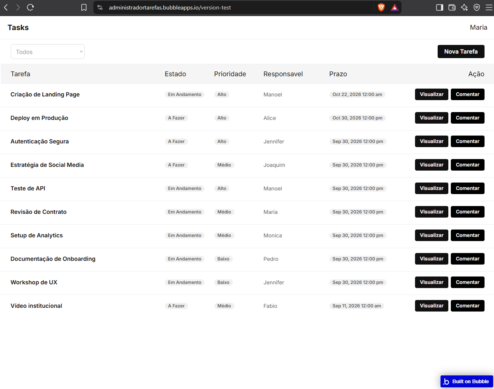

# 📋 Administrador de Tarefas (Bubble.io)

Uma aplicação web desenvolvida sem código (No-Code) na plataforma **Bubble.io** para solucionar o desafio de gestão de tarefas, prazos e colaboração.

---

## 🔗 Links de Acesso

- **Aplicação Funcional (Ambiente de Teste):** [https://administradortarefas.bubbleapps.io/version-test](https://administradortarefas.bubbleapps.io/version-test)
- **Vídeo Pitch de Apresentação:** *[https://youtu.be/8Tz_QiEi1xs](https://youtu.be/8Tz_QiEi1xs)*

---

## 🎯 Funcionalidades Principais

- **📊 Lista de Tarefas:** Visualização das tarefas organizadas por estado, prioridades e prazos de entrega.
- **📝 Gestão da Tarefa:** Criação, edição, atribuição de responsáveis e alteração dinâmica de estado (*Pendente*, *Em Andamento*, *Concluído*).
- **💬 Comentários:** Formulário para discussões internas associadas a cada tarefa.
- **🔔 Notificações & E-mails Automáticos:** Envio automatizado de e-mails para notificantes quando uma nova interação ocorre.

---

## 🛠️ Tecnologias Utilizadas

- **Plataforma No-Code:** [Bubble.io](https://bubble.io/)
- **Provedor de E-mail (SMTP):** SendGrid integration via Bubble Workflow Actions
- **Banco de Dados:** Bubble Native Database

---

## ✒️ Autor

- **Nome:** Fabio Minami
- **Projeto:** Primeiro Produto Digital com Bubble (Low-Code / No-Code)
